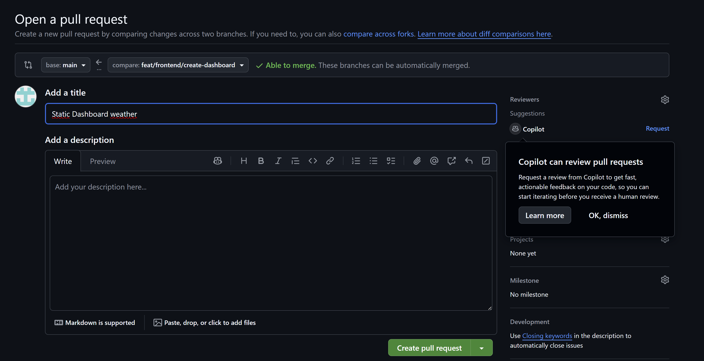

# Pull Request #3 - Static Dashboard Weather

## Informations générales

**Titre**: Static Dashboard weather  
**Branche source**: feat/frontend/create-dashboard  
**Branche cible**: main  
**Auteur**: LilianLPV (lilian.lepiver@ynov.com)  
**Statut**: Prête à merger (pas de conflits)

## Description

Cette pull request introduit un dashboard météo statique dans la partie frontend de l'application.

## Détails de la merge

### Statistiques
- 1 commit
- 20 fichiers modifiés
- 0 conflit avec la branche de base
- Merge automatique possible

### Commit
- Message: "Static Dashboard weather"
- Auteur: LilianLPV

## Statut

La pull request est ouverte et en attente de review. Aucun conflit détecté, la merge peut être effectuée automatiquement.

## Actions disponibles

- Review par Copilot disponible
- Merge pull request
- Convert to draft (si travaux en cours)

---

**Note**: Les images référencées (image-1.png, image-2.png, image-3.png) correspondent aux captures d'écran de l'interface GitHub pour cette pull request.